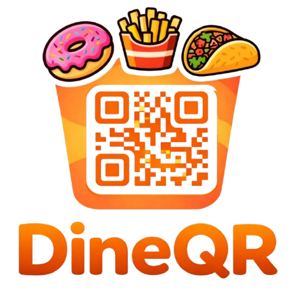

<div align="center">

  

  # DineQR — Scan. Order. Enjoy. 🍽️⚡

  **A modern, full-stack MERN contactless QR digital menu and real-time restaurant management platform.**

  [](https://nodejs.org/)
  [](https://reactjs.org/)
  [](https://expressjs.com/)
  [](https://www.mongodb.com/)
  [](https://socket.io/)
  [](https://tailwindcss.com/)

</div>

---

## 🌟 Overview

**DineQR** transforms traditional dining by replacing physical menus with instant, contactless QR code digital ordering. Customers scan a table-specific QR code using any smartphone camera, browse the restaurant menu, and place orders directly to the kitchen without installing any application.

For restaurant owners and kitchen staff, DineQR provides a powerful **Real-Time Dashboard** powered by WebSockets to manage incoming orders, menu items, table QR generation, and sales analytics effortlessly.

---

## ✨ Features

### 📱 Customer Mobile Menu (QR Experience)
- **Instant Table QR Scanning**: Automatically detects table number from URL params (`?table=X`).
- **Interactive Menu Browsing**: Category filtering, live search bar, and dish descriptions.
- **Seamless Cart & Checkout**: Interactive floating cart checkout with "Pay at Counter / Server" workflow.
- **Real-Time Order Tracking**: WebSockets (`Socket.io`) notify customers live as their order changes status (`Received` ➔ `Preparing` ➔ `Ready` ➔ `Completed`).

### 👨‍🍳 Restaurant Admin Dashboard
- **Analytics Overview**: Real-time sales metrics, order counts, active customer table counts, and average prep times.
- **Live Kitchen Orders Board**: Kanban-style real-time board to update order statuses in one click.
- **Menu Management**: Categorized dish management, pricing updates, image URLs, and instant availability toggles.
- **Table QR Generator & PNG Canvas Download**: Generate table QR codes with custom printable branding tags (*"Scan To See Our Menu"*).
- **Settings & Identity**: Customize restaurant logo, name, location, contact details, and subscription plan tiers (`Starter`, `Pro`, `Business`).

### 🔒 Security & Auth
- **Google OAuth 2.0**: One-click Google Sign-in integration.
- **JWT & HTTP-Only Cookies**: Secure session token authentication with Bcrypt password hashing.

---

## 🛠️ Tech Stack

| Domain | Technology |
| :--- | :--- |
| **Frontend Framework** | React.js (Vite) |
| **Styling** | TailwindCSS, Lucide Icons, React Hot Toast |
| **State Management** | Zustand |
| **Backend Runtime** | Node.js (ES Modules) |
| **Server Framework** | Express.js |
| **Database & ORM** | MongoDB & Mongoose |
| **Real-Time Signals** | Socket.io (WebSockets) |
| **Auth & Security** | Google OAuth 2.0, JWT, BcryptJS, Cookie-Parser |

---

## 📂 Repository Structure

```
DineQR-Scan.Order.Enjoy/
├── client/                     # Vite React Frontend
│   ├── src/
│   │   ├── assets/             # Brand images & logos
│   │   ├── components/         # Reusable UI components & Auth forms
│   │   ├── pages/              # CustomerMenu, LiveOrders, Overview, QRCodePage, Settings, AuthPage
│   │   ├── store/              # Zustand Auth & Cart global stores
│   │   ├── App.jsx             # Main router configuration
│   │   └── main.jsx            # React root mount
│   └── package.json
│
└── server/                     # Express & Node.js Backend API
    ├── src/
    │   ├── config/             # DB & Socket connection configs
    │   ├── controllers/        # Auth, Restaurant, Menu, Order controllers
    │   ├── middleware/         # Auth verification middleware
    │   ├── models/             # User, Restaurant, Category, MenuItem, Order schemas
    │   ├── routes/             # RESTful API endpoints
    │   └── server.js           # Server startup script
    └── package.json
```

---

## 🚀 Quick Start & Installation

### Prerequisites
- **Node.js**: v18.0.0 or higher
- **MongoDB**: Local MongoDB instance or MongoDB Atlas Connection URI

### 1. Clone the Repository
```bash
git clone https://github.com/ashishrathi21/DineQR.git
cd DineQR-Scan.Order.Enjoy
```

### 2. Configure Environment Variables

Create `.env` inside **`server/`**:
```env
PORT=5000
MONGO_URI=mongodb://localhost:27017/dineqr
JWT_SECRET=your_jwt_secret_key_here
CLIENT_URL=http://localhost:5173
NODE_ENV=development
```

Create `.env` inside **`client/`**:
```env
VITE_API_URL=http://localhost:5000/api
VITE_SOCKET_URL=http://localhost:5000
VITE_GOOGLE_CLIENT_ID=your_google_client_id_here
```

### 3. Install Dependencies & Start Server

**Backend Setup:**
```bash
cd server
npm install
npm run dev
```

**Frontend Setup:**
```bash
cd client
npm install
npm run dev
```

Open your browser at `http://localhost:5173/` to launch DineQR! 🎉

---

## 📄 License & Attribution

Designed & Developed with ❤️ by **[Ashish Rathi](https://github.com/ashishrathi21)**.

Licensed under the [ISC License](LICENSE).
